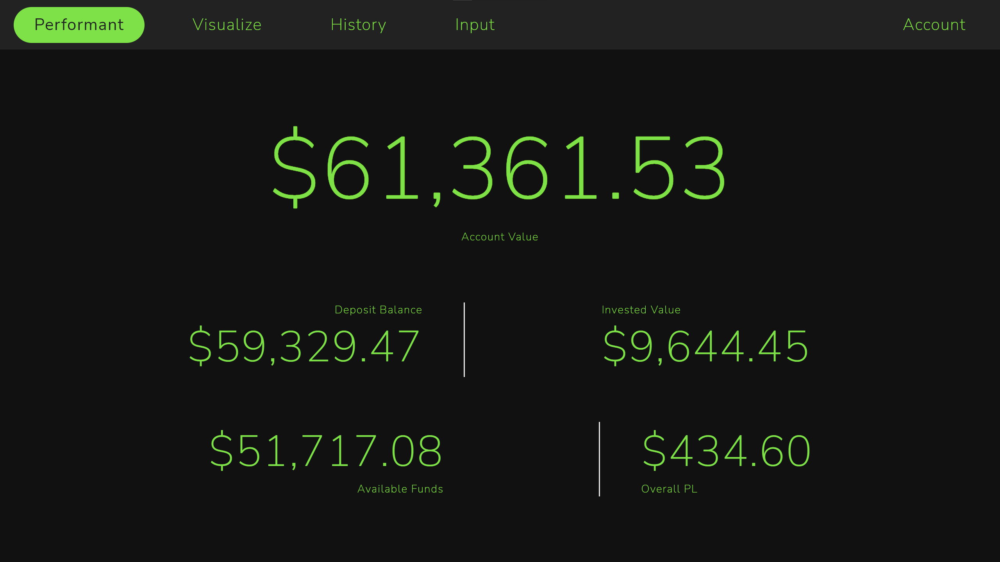

# HackCWRU 2022: Performant

## By Kris Zhao

Welcome to my Hack CWRU Fintech submission! The devpost can be accessed [here](https://devpost.com/software/performant-semi-automated-investment-tracking-and-analysis).

## Problem Statement:

Successful investments is all about managing risk and evaluating factors that may be beneficial. As such, there are many calculations, averages and metrics associated with it. Even more so with technicalities such as FIFO selling designations especially when it comes to tax calculations. All of this information can make the investment space hyper cluttered with simple fundamentals hidden to a user.

## Solution:

Performant hopes to remedy this by providing a single, simple, and semi-automated process for getting a high level overview of your investment portfolio. This could then inform you of your risk tolerance, or the general market trends. Perhaps it might even illustrate how bad you are at this, saving you money in the long run by pushing you towards safer strategies such as ETFs and Funds.

More in the details, Performant provides a simple account funding and transactions page, which pulls and calculates metrics automatically, then allows you to explore graphs and summary metrics. In this regard, it is heavily oriented as a summary tool and not meant for high frequency or intra day trading.

## Demonstrations:

### Video Walkthrough:

A youtube demonstration can be located [here](https://youtu.be/qNfomf8AkmM) of simple functionality.

### Images:

Check out the [image library](#image-library) at the bottom for demonstration of the functionality.

## Overall structure:

This project is organized into four primary components, the backend, market data source (TDAmeritrade API), a database, and frontend. Each folder will have more in depth READMEs but a high level overview is provided here:

### Python Backend

The backend for ths project is built up in `Python (3.8.6)` in anticipation of various calculations and aggregations as well as it's ability to simply link various components together. As a light weight API backend, I decided to use `Flask` running on my computer paired with the `requests` python library for API calls. Additionally, the Python backend had to connect with the database and used the `psycopg2` driver.

### TDA Market Data:

Market data (price history) was queried through the `TDAmeritrade developer API`. This API requires a trading account with TDA as well as setup of a secondary developer account. This was chosen as it had an allotment of up to 120 requests per minute, or 2 requests per second. This was much better than the nearest competition.

For an alternative, `Yahoo finance` has a free tier which, out of development when this app would only make a low number of calls anyways, could suffice. It allows for 100 free requests per day.

### Postgres Database:

In order to manage all of the user information and calculations, I went ahead with a `Postgres relational database`. The reason was that I was more familiar with this (as apposed to a noSQL database), and hosting a local instance means there will be no latency or rate limiting.

The database ended up as version 14.2 running on a NAS and was able to serve all requests / queries with ease.

### Angular Frontend:

Finally, everything on the user-facing side is taken care of with an `Angular SPA`. I like using angular for user interfaces because I believe web-based applications are easily scalable, deployable, and fast to create. The application was purely developed with the build in development server for ease hosted on my computer.

## Goals:

While developing this project, I had a set of goals in mind. Suffice to say, not all goals were reached but I believe this is a great launch point and platform for building up the rest of the application.

### Achieved goals:

1. User Interface Completed
   1. Summary page provides a overview of various metrics
   2. Navigation is simple and intutive.
   3. User interface isn't awful.
   4. Integration with (new) graphing libraries to show important metrics and provide visualizations.
   5. Position overviews and transaction history listed.
   6. Easy position entry form.
   7. Easy account balance form.
2. TDA API Utilized:
   1. I was able to pull information and interact with the TDA API. This will allow for some really cool future projects.
   2. Simple authentication was completed while (hopefully) protecting it.
3. Backend created.
   1. New use of Flask was completed and I realized how simple it was to create a REST api with it.
   2. Various metric calculations were completed in order to aggregate information.
   3. Utilization of the python Postgres driver was learned.
   4. Use of the new Requests library was learned.
4. Database:
   1. A database schema was created to support the entire application accessible on my local network. This can allow for LAN web tools that can persist.
   2. Fluency with Database tools were learned.

### Unachieved goals:

1. There is only one associated account (default).
   1. With the schema developed for multiple user accounts, it should be fairly simple to support multiple user accounts in the future.
2. Dividends:
   1. Dividends were not factored in. With the TDA API it should be fairly straight forward. It would require another table but otherwise remains similar with position tracking.
3. Margin:
   1. While margin trading is not recommended in my opinion, support for Margin could be useful and round out the application.
4. Deleting / removing / editing transactions
   1. Currently, transactions cannot be deleted or modified. You can still exit positions (sell or defund your account) but you cannot directly "undo" a transaction.
   2. Similarly, this should be fairly simple including API endpoints to delete X transaction.
5. Graph overlays + advanced features.
   1. To be honest, there was not enough time to delve deep enough into the new graphing libraries. They were fairly awful to use but I hope to learn more to achieve more complex functionlality.
   2. This includes comparing various stocks on the same graph, ore re-scaling axes to align metrics such as P&L % with stock quantity.

### Future developments:

I had originally wanted to develop this project with new and scalable tools such as React (react native), and noSQL (such as amazon dynamo) but felt familiar tools would work better with the time crunch.
- Short term: I believe more functionality and robustness can be built into the code and it can persist on the local network to manage all of my investments.
- Long term: I want to move this into React to take advantage of desktop + mobile marketplaces and potentially push it out as a simplified insight tool.

## Image library:

### Display the account's summary metrics:

### Display a single positions analytics:

### Visualize all previous stock purchases:

### Insert a new stock position:

### Fund and manage account information:

